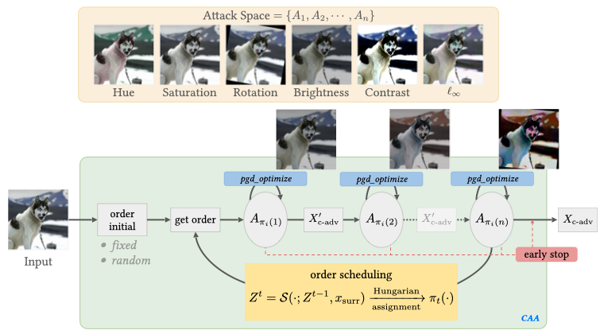

# Composite-Adv
[**CVPR 2023**](https://arxiv.org/abs/2202.04235)
| [**Demonstration**](https://hsiung.cc/CARBEN/)
| [**Quickstart**](#installation)
| [**Usage**](#usage)
| [**Join Leaderboard**](#join-leaderboard)
| [**Citation**](#citations)

## Overview
This repository contains code for the **CVPR 2023 Paper** "[Towards Compositional Adversarial Robustness: 
Generalizing Adversarial Training to Composite Semantic Perturbations](https://arxiv.org/abs/2202.04235)." The research
demo and the leaderboard of composite adversarial robustness can be found at [CARBEN: Composite Adversarial Robustness 
Benchmark](https://hsiung.cc/CARBEN/), which earlier appeared in [IJCAI 2022 Demo Track](https://arxiv.org/abs/2207.07797).

Authors: [Lei Hsiung](https://hsiung.cc/), [Yun-Yun Tsai](https://yunyuntsai.github.io/), [Pin-Yu Chen](http://pinyuchen.com/), and [Tsung-Yi Ho](https://www.cse.cuhk.edu.hk/people/faculty/tsung-yi-ho/).

## Composite Adversarial Attack (CAA)
The adversarial attacks have been widely explored in Neural Network (NN). However, previous studies have sought to
create bounded perturbations in a metric manner.  Most such work has focused on $\ell_{p}$-norm perturbation (i.e.,
$\ell_{1}$, $\ell_{2}$, or $\ell_{\infty}$) and utilized gradient-based optimization to effectively generate the 
adversarial example. However, it is possible to extend adversarial perturbations beyond the $\ell_{p}$-norm bounds.

<p align="center"></p>
<p align="center">Figure 1. The Flow of the Composite Adversarial Attacks.</p>

We combined the $\ell_\infty$-norm and semantic perturbations (i.e., hue, saturation, rotation, brightness, and
contrast), and proposed a novel approach — composite adversarial attack (CAA) — capable of generating unified 
adversarial examples (see Figure 1). The main differences between CAA and previously proposed perturbations are a) that CAA 
incorporates several threat models simultaneously, and b) that CAA's adversarial examples are semantically similar
and/or natural-looking, but nevertheless result in large differences in $\ell_{p}$-norm measures.

In this README, we are going to show how to execute our code and derive the experimental results in our paper.

## Installation
Composite-adv can be downloaded as a GitHub repository or a package, the code including training (GAT) and robustness evaluation (CAA) phases.

- Install [Python 3](https://www.python.org/).
- Use `Composite-Adv` as a package.
  ```shell
  pip install git+https://github.com/IBM/composite-adv.git
  ```
- Use `Composite-Adv` as a repository.
  ```shell
  git clone https://github.com/IBM/composite-adv.git
  cd composite_adv
  pip install -r requirements.txt
  ```

## GAT Pretrained Models and Baselines
Please use `composite_adv.utilities.make_model()` to load GAT pre-trained models.
### CIFAR-10
Two Architectures Available: ResNet-50 ($\dagger$) and Wide-ResNet-34-10 ($\ast$).

| $\text{GAT}^\dagger\text{-f}$ | $\text{GAT}^\dagger\text{-fs}$ | $\text{GAT}^\ast\text{-f}$|$\text{GAT}^\ast\text{-fs}$|
|--|--|--|--|
| [Link](https://drive.google.com/file/d/1M569sLluA_nCKzkeKMaK_4PCII3LKKnJ/)| [Link](https://drive.google.com/file/d/1109eOxG5sSIxCwe_BUKRViMrSF20Ac4c/) | [Link](https://drive.google.com/file/d/1Js1v5W_m40SjS_tYEMQF72n37_AxQZY0/) |[Link](https://drive.google.com/file/d/1hWcgfvQUTOgDpvmZg4kTJLakSIdm-Tlx/)|
| $\text{Normal}^\dagger$ | $\text{Madry}_\infty^\dagger$ | $\text{PAT}_\text{self}^\dagger$ | $\text{PAT}_\text{alex}^\dagger$ | 
| [Link](https://github.com/MadryLab/robustness) | [Link](https://github.com/MadryLab/robustness) | [Link](https://github.com/cassidylaidlaw/perceptual-advex) | [Link](https://github.com/cassidylaidlaw/perceptual-advex) | 
| $\text{Normal}^\ast$ | $\text{Trades}_\infty^\ast$ | $\text{FAT}_\infty^\ast$ | $\text{AWP}_\infty^\ast$ |
| [Link](https://drive.google.com/file/d/14WZa--L9lIaEZuUCWhvbrtk46uZVN3rO/) | [Link](https://github.com/yaodongyu/TRADES) | [Link](https://github.com/zjfheart/Friendly-Adversarial-Training) | [Link](https://github.com/csdongxian/AWP) |


### ImageNet

One Architecture Available: ResNet-50 ($\dagger$).


| $\text{GAT}^\dagger\text{-f}$ | $\text{Normal}^\dagger$ | $\text{Madry}_\infty^\dagger$ | $\text{FAST-AT}_\infty^\dagger$|
|--|--|--|--|
| [Link](https://drive.google.com/file/d/1PSmy_DrTExna_x4s_Lnuk6UnBFGh9X41/)| [Link](https://github.com/MadryLab/robustness)| [Link](https://github.com/MadryLab/robustness) | [Link](https://github.com/cassidylaidlaw/perceptual-advex) |

### SVHN
One Architectures Available: Wide-ResNet-34-10 ($\ast$).


| $\text{GAT}^\ast\text{-f}$ | $\text{GAT}^\ast\text{-fs}$ | $\text{Normal}^\ast$ |$\text{Trades}_\infty^\ast$ |
|--|--|--|--|
| [Link](https://drive.google.com/file/d/1qqPtncIdSW8GVjwXg-HzlsgveANLmbe4/)| [Link](https://drive.google.com/file/d/160Ena0A7eeOjIprZ_1jsDKpcYz0HW_kp/)| [Link](https://drive.google.com/file/d/1786gOKewJ4VX24s1IPT9tr0-JeyeT1AQ/) |[Link](https://drive.google.com/file/d/11C7Sfh1KiO9TM_8Lpv6QopigzobXLmNz/) |


## Usage

This section demonstrate how to launch CAA and also using GAT to derive a robust model.

### Getting Started

In [getting_started.ipynb](getting_started.ipynb), we provide a step-by-step demonstration showing how to launch our composite adversarial attack (CAA).
We use the CIFAR-10 dataset for demonstration, while other datasets could be executed similarly.

[](https://colab.research.google.com/github/IBM/composite-adv/blob/main/getting_started.ipynb)

## Scripts for running the experiments
### Composite Adversarial Attack (CAA) Evaluation
Evaluate robust accuracy / attack success rate of the model
##### Multiple Attacks
```shell
python evaluate_model.py \
       --arch ARCHITECTURE --checkpoint PATH_TO_MODEL \
       --dataset DATASET_NAME --dataset-path DATASET_PATH --input-normalized \
       --message MESSAGE_TO_PRINT_IN_CSV \
       --batch-size BATCH_SIZE --output RESULT.csv \
        "CompositeAttack(model, enabled_attack=(0,1,5), order_schedule='random', inner_iter_num=10, dataset='DATASET_NAME')" \
        "CompositeAttack(model, enabled_attack=(0,1,5), order_schedule='scheduled', inner_iter_num=10, dataset='DATASET_NAME')" \
        "CompositeAttack(model, enabled_attack=(3,4,5), order_schedule='random', inner_iter_num=10, dataset='DATASET_NAME')" \
        "CompositeAttack(model, enabled_attack=(3,4,5), order_schedule='scheduled', inner_iter_num=10, dataset='DATASET_NAME')" \
        "CompositeAttack(model, enabled_attack=(0,2,5), order_schedule='random', inner_iter_num=10, dataset='DATASET_NAME')" \
        "CompositeAttack(model, enabled_attack=(0,2,5), order_schedule='scheduled', inner_iter_num=10, dataset='DATASET_NAME')" \
        "CompositeAttack(model, enabled_attack=(0,1,2,3,4), order_schedule='random', inner_iter_num=10, dataset='DATASET_NAME')" \
        "CompositeAttack(model, enabled_attack=(0,1,2,3,4), order_schedule='scheduled', inner_iter_num=10, dataset='DATASET_NAME')" \
        "CompositeAttack(model, enabled_attack=(0,1,2,3,4,5), order_schedule='random', inner_iter_num=10, dataset='DATASET_NAME')" \
        "CompositeAttack(model, enabled_attack=(0,1,2,3,4,5), order_schedule='scheduled', inner_iter_num=10, dataset='DATASET_NAME')"
```

##### Single Attacks
```shell
python evaluate_model.py \
       --arch ARCHITECTURE --checkpoint PATH_TO_MODEL \
       --dataset DATASET_NAME --dataset-path DATASET_PATH --input-normalized \
       --message MESSAGE_TO_PRINT_IN_CSV \
       --batch-size BATCH_SIZE --output RESULT.csv \
        "NoAttack()" \
        "CompositeAttack(model, enabled_attack=(0,), order_schedule='fixed', inner_iter_num=10, dataset='DATASET_NAME')" \
        "CompositeAttack(model, enabled_attack=(1,), order_schedule='fixed', inner_iter_num=10, dataset='DATASET_NAME')" \
        "CompositeAttack(model, enabled_attack=(2,), order_schedule='fixed', inner_iter_num=10, dataset='DATASET_NAME')" \
        "CompositeAttack(model, enabled_attack=(3,), order_schedule='fixed', inner_iter_num=10, dataset='DATASET_NAME')" \
        "CompositeAttack(model, enabled_attack=(4,), order_schedule='fixed', inner_iter_num=10, dataset='DATASET_NAME')" \
        "CompositeAttack(model, enabled_attack=(5,), order_schedule='fixed', inner_iter_num=20, dataset='DATASET_NAME')" \
        "AutoLinfAttack(model, 'DATASET_NAME')"
```

### Generalized Adversarial Training (GAT)
#### CIFAR-10
##### Single Node, MultiGPUs, Single-Processing, Multi-Threading (TRADES Loss)
```shell
python train_cifar10.py \
        --batch-size BATCH_SIZE --epochs 150 --arch ARCHITECTURE \
        --checkpoint PATH_TO_MODEL_FOR_RESUMING.pt \
        --mode TRAINING_OBJECTIVE --order random --enable 0,1,2,3,4,5 \
        --model-dir DIR_TO_SAVE_EPOCH/ \
        --log_filename TRAINING_LOG.csv
```

##### Distributed, MultiGPUs, Multi-Processing (Madry's Loss)
```shell
python train_cifar10.py \
        --dist-backend 'nccl' --multiprocessing-distributed \
        --batch-size BATCH_SIZE --epochs 150 --arch ARCHITECTURE \
        --checkpoint PATH_TO_MODEL_FOR_RESUMING.pt \
        --mode TRAINING_OBJECTIVE --order random --enable 0,1,2,3,4,5 \
        --model-dir DIR_TO_SAVE_EPOCH/ \
        --log_filename TRAINING_LOG.csv
```

#### ImageNet
```shell
python train_imagenet.py \
        --dist-backend 'nccl' --multiprocessing-distributed \
        --batch-size BATCH_SIZE  --epochs 150 --arch ARCHITECTURE \
        --checkpoint PATH_TO_MODEL_FOR_RESUMING.pt --stat-dict TYPE_OF_CHECKPOINT \
        --mode TRAINING_OBJECTIVE --order random --enable 0,1,2,3,4,5 \
        --model-dir DIR_TO_SAVE_EPOCH \
        --log_filename TRAINING_LOG.csv
```

#### SVHN
```shell
python train_svhn.py \
        --batch-size BATCH_SIZE --epochs 150 --arch ARCHITECTURE \
        --checkpoint PATH_TO_MODEL_FOR_RESUMING.pt \
        --mode TRAINING_OBJECTIVE --order random --enable 0,1,2,3,4,5 \
        --model-dir DIR_TO_SAVE_EPOCH/ \
        --log_filename TRAINING_LOG.csv
```

## Join Leaderboard
We maintain the [leaderboards](https://hsiung.cc/CARBEN/) to track the progress of the 
**Compositional Adversarial Robustness**. Specifically, we focus on "white-box" scenarios in which the attacker has all
knowledge of the models. We have provided similar entries to those in the RobustBench leaderboard, and hereby solicit 
model submissions to compete against composite perturbations in our leaderboard. If you would like to submit your model,
please fill out the [Google Form](https://forms.gle/nNhPgQiq2jyyUCmA7).

## Citations
If you find this helpful for your research, please cite our papers as follows:

    @inproceedings{hsiung2023caa,
      title={{Towards Compositional Adversarial Robustness: Generalizing Adversarial Training to Composite Semantic Perturbations}}, 
      author={Lei Hsiung and Yun-Yun Tsai and Pin-Yu Chen and Tsung-Yi Ho},
      booktitle={{IEEE/CVF} Conference on Computer Vision and Pattern Recognition, {CVPR}},
      publisher={{IEEE}},
      year={2023},
      month={June}
    }

    @inproceedings{hsiung2022carben,
      title={{CARBEN: Composite Adversarial Robustness Benchmark}},
      author={Lei Hsiung and Yun-Yun Tsai and Pin-Yu Chen and Tsung-Yi Ho},
      booktitle={Proceedings of the Thirty-First International Joint Conference on Artificial Intelligence, {IJCAI-22}},
      publisher={International Joint Conferences on Artificial Intelligence Organization},
      year={2022},
      month={July}
    }

